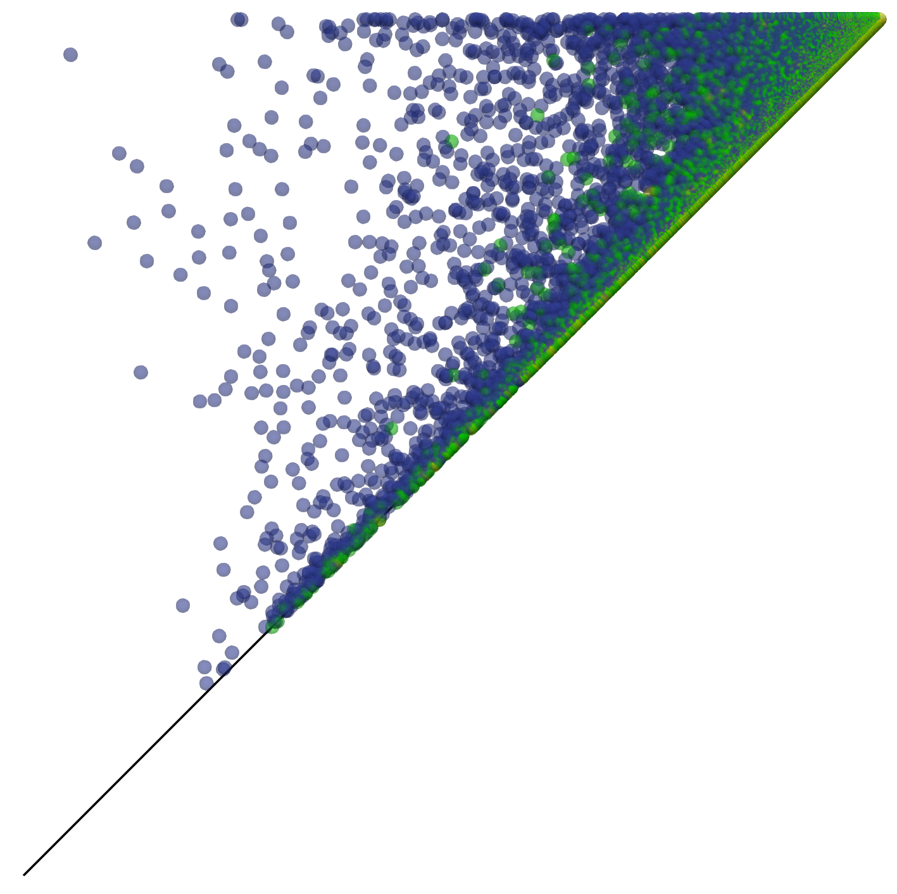
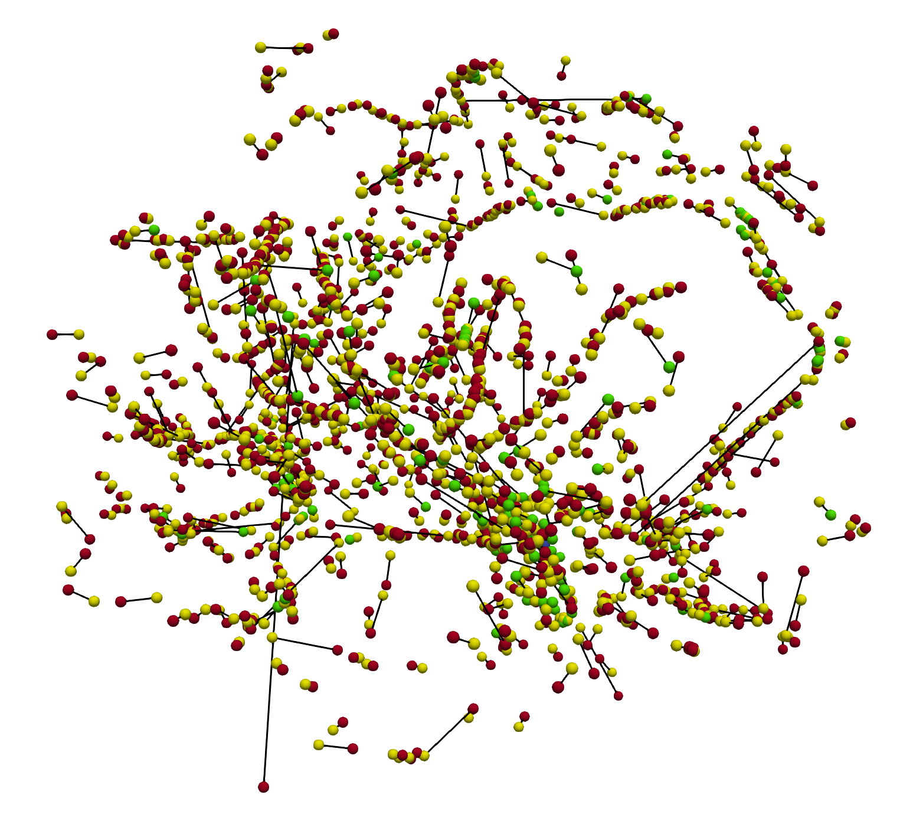
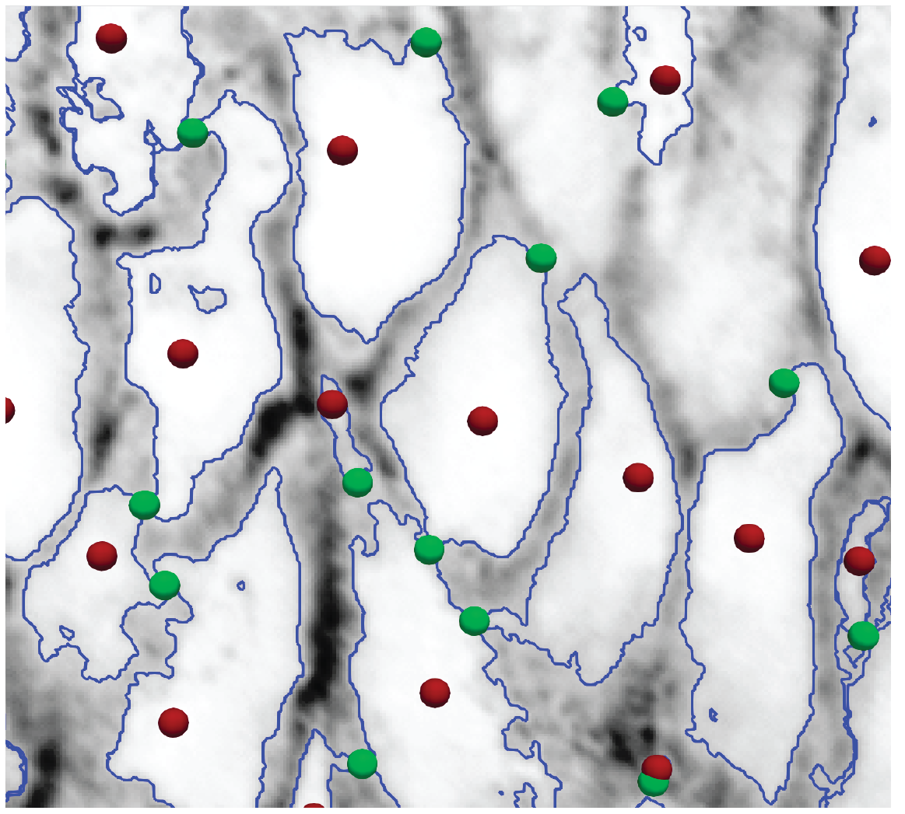
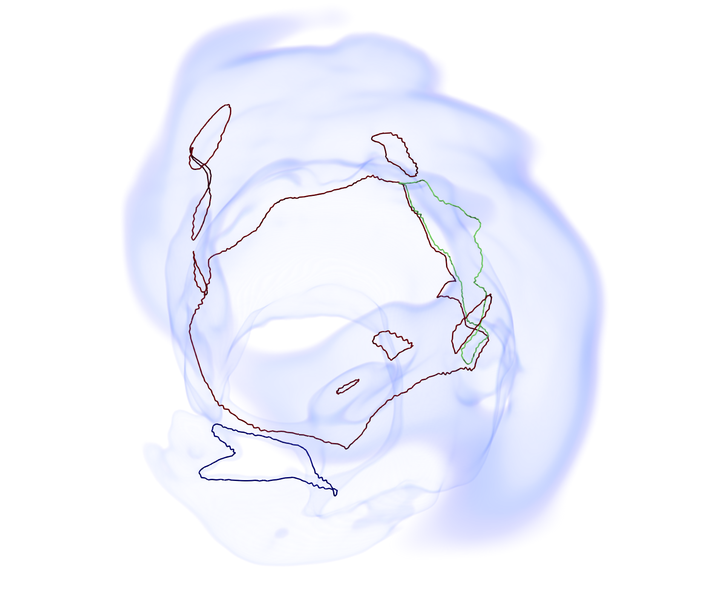
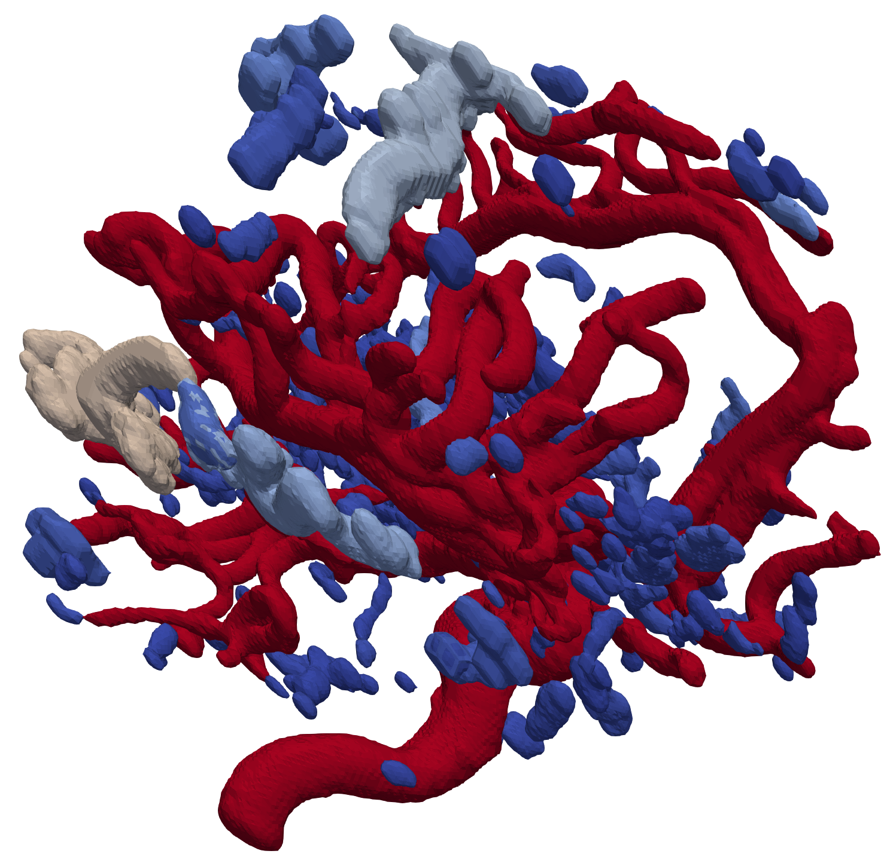
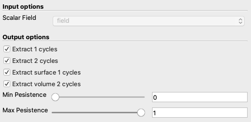
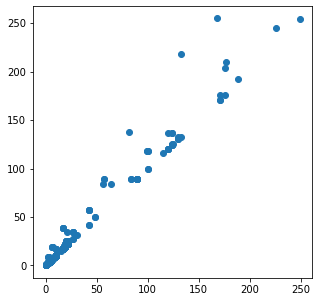

## Introduction

Topological approaches have been transformative for scientific visualization, offering new ways to explore data from a qualitative point of view

This tool focuses on persistent homology. Intuitively, persistent homology tracks topological features and ranks them based on their lifespan. Information captured by persistent homology is commonly represented by the persistence diagram that, even if mathematically sound, is not well suited for visualization. The main drawback of the persistence diagram is that of representing the lifespan of topological features losing connection with the domain space.

The main objective of this tool is computing and visualizing an explicit representation of the topological features captured by persistent homology, that we call persistence cycles. The tool focuses on the computation of persistent homology for 2D and 3D scalar fields and uses discrete Morse theory for achieving efficiency. 

The algorithm (described in our [TVCG paper](http://fiurici.people.clemson.edu/papers/tvcg2021-2.pdf)) is implemented as a module for the [Topology ToolKit](https://topology-tool-kit.github.io).

    


## Installation

There are two ways to install the modules provided in this repository. Currently, both of them will require installing Paraview and TTK in your system. The [Topology ToolKit](https://topology-tool-kit.github.io) (TTK) is an open-source library and software collection for topological data analysis and visualization. 


### Installing TTK for the first time

If you have never used TTK before, it means you will have to compile Paraview and TTK from scratch following the instructions from the original [TTK website](https://topology-tool-kit.github.io/installation-0.9.7.html).

The only difference in the installation process is that you will have to use the TTK distribution provided in this repository (folder ttk-0.9.7) instead of downloading it from the TTK website.


### Integrating an existing TTK folder

If you already have TTK installed you can add the modules provided in this repository to your folder. You will have to create three modules and copy and past files contained in this repository.

Access yuor ttk folder and run the following commands

```
    ./scripts/createTTKmodule.sh BoundaryMatrix
    ./scripts/createTTKmodule.sh FormanGradient
    ./scripts/createTTKmodule.sh FG_PersistentHomology
```

The first line will create an empty module for implementing the [sequential algorithm](http://www.math.uchicago.edu/~shmuel/AAT-readings/Data%20Analysis%20/Edelsbrunner-Letscher-Zomordian.pdf) used for computing persistent homology. 
The second line will create an empty module for implementing the [Forman gradient](https://ieeexplore.ieee.org/document/5766002) at the base of the computation of persistent homology and the persistence cycles.
The third line will create an empty module for implementing the computation of the [persistence cycles](http://fiurici.people.clemson.edu/papers/tvcg2021-2.pdf).

Once all modules have been created, you will have to remove files and folders that are not used in our plugin. You can do that by running the following command assuming you are in your TTK folder

```
    rm -R ./core/vtk/ttkBoundaryMatrix
    rm -R ./core/vtk/ttkFormanGradient
    rm -R ./paraview/BoundaryMatrix
    rm -R ./paraview/FormanGradient
    rm -R ./standalone/BoundaryMatrix
    rm -R ./standalone/FormanGradient
    rm -R ./standalone/FG_PersistentHomology
```

Now, you simply have to copy and past files provided in this repository to your local folder. Specifically, you have to substitute all files in the following folders

```
    ./core/base/boundaryMatrix
    ./core/base/formanGradient
    ./core/base/fG_PersistentHomology

    ./core/vtk/ttkFG_PersistentHomology

    ./paraview/FG_PersistentHomology
```

Once you are done, run the commands `cmake` and `make` again and the module `FG_PersistentHomology` should be part of your pool of modules in TTK.

## Using the module

### Visualizing persistence and the persistence pairs

Here we describe how to interact with the user interface in Paraview in order to visualize all the information computed by our module. Notice that you always have a chance to [run these modules automatically](https://topology-tool-kit.github.io/tutorials.html#python), for example in python, in order to automatize most of these steps.

#### Output


`FG_PersistentHomology` produces seven outputs. If you are not familiar with persistent homology, we suggest reading our [paper]() or alternative introductory papers before continuing. 

The output produced by the plugin is composed by:

- `Persistence Pairs` are the persistence pairs embedded in the domain of the input scalar field. Each pair is visualized with a line connecting a pair of points. The points correspond to the simplices creating and destroying a homology class. Each point is characterized by a `filtration value` and a `CelDimension` indicating the corresponding simplex dimension. Each line is characterized by a `filtration value` and a `type` indicating the homology class's dimension.

- `Persistence Diagram` the points populating the persistence diagram. Each point is characterized by a `filtration value` and a `Pair type` indicating the dimension of the homology class the point represents.

- `Homology` the points representing homology classes that never die. When working with images, this should contain a single point indicating the first vertex introduced in the filtration (i.e., global minimum).

- `1-cycles`, the persistence cycles computed for each persistence pair of type 1. Each persistence cycles is characterized by a unique identifier `CycleId` and a filtration value indicating the lifespan of such cycle

- `1-holes` persistence cycles are computed by visiting portions of the original dataset. In the case of persistence 1-cycles, these correspond to surfaces that are stored in `1-holes` for each persistence pair of type 1. Each hole is characterized by a unique identifier `CycleId` equal to the id of the corresponding cycle and a filtration value indicating such a cycle's lifespan.

- `2-cycles`, the persistence cycles computed for each persistence pair of type 2. Each persistence cycles is characterized by a unique identifier `CycleId` and a filtration value indicating the lifespan of such cycle

- `2-holes` persistence cycles are computed by visiting portions of the original dataset. In the case of persistence 2-cycles, these correspond to volumes that are stored in `2-holes` for each persistence pair of type 1. Each hole is characterized by a unique identifier `CycleId` equal to the id of the corresponding cycle and a filtration value indicating such a cycle's lifespan.


#### Interface



Extraction of 1-cycles/2-cycles and 1-holes/2-holes is disabled by default and can be activated from the properties panel by clicking on the corresponding checkbox.

The user can also limit the extraction of persistence pairs, cycles, and holes only to homology classes with a certain persistence. This is done by specifying the interval of normalized persistence of interest (`Min Persistence`, `Max persistence`).


### Reading Persistence Cycles and Persistence pairs in Python

Once computed, you can export persistence cycles and persistence pairs with the command `Save Geometry` in Paraview. After that, you will obtain `vtk` files that can be imported, for example, into a python script. You will simply need a python library capable of reading vtk files (I like to use [meshio](https://pypi.org/project/meshio/)). Suppose you computed persistence 2-cycles and persistence pairs saving them into two files `2-cycles.vtk` and `ppairs.vtk`, all we have to do is


```python
import meshio
pairs = meshio.read("ppairs.vtk")
```

if you take a look at what `pairs` contains

```
<meshio mesh object>
  Number of points: 802
  Number of cells:
    line: 401
  Point data: CellDimension, Filtration%20value%20vertex
  Cell data: Filtration, Type
```

We recall that persitence pairs are plotted as lines connecting the centroids of the simplices responsible for creating and destroying an homology class.
For each point we have two scalar fields:
- `CellDimension` indicate the dimension of the corresponding simplex (0,1,2, or 3)
- `Filtration` indicate the filtration value

For each line we also have two scalar fields
- `Persistence` indicate the persistence value associated to such pair
- `Type` indicate the type of the pair (0,1,2)

The same thing can be done for reading persistence cycles

```python
import meshio
data = meshio.read("2-cycles.vtk")
```

```
<meshio mesh object>
  Number of points: 3469
  Number of cells:
    triangle: 8208
  Cell data: CycleId, Filtration
```


We recall that 2-cycles are formed by triangles. For triangle we have two scalar fields:
- `CycleId` this is a unique id for identifying the cycle. In practice, triangles having the same value of `CycleId`, belong to the same cycle. Moreover, the `CycleID` indicate the persistence pair corresponding to the cycle. To retrieve the pair we need a little extra work.

First, persistence pairs are ordered according to their type, so first thing we need to find where persistence pairs of type 2 start.

```python
    position_pairs2=0
    for i in range(0,len(ppairs.cell_data['Type'])):
        if ppairs.cell_data['Type'][0][i] == 2:
            position_pairs2 = i
```

Then, supposing the `CycleId` we were searching for had value `id`, the corresponding pair is simlpy retrieved with the following command

    ```python
        pairs.cells[0].data[position_pairs2 + idn]
    ```

- `Filtration` indicate the filtration value (the time at which the triangle has been introduced)


Notice that the persistence pairs we are using here are embedded in the original domain space. However, we have all the necessary to retrieve the persistence pairs embedded in the space of the persistence diagram. We can simply run

```python

pers_diag = []

for line in ppairs.cells[0].data:
    v0 = line[0]
    v1 = line[1]
    
    f0 = ppairs.point_data["Filtration"][v0]
    f1 = ppairs.point_data["Filtration"][v1]
    pers_diag.append([f0,f1])

```

which will produce pairs with which creating a classic persistence diagram



